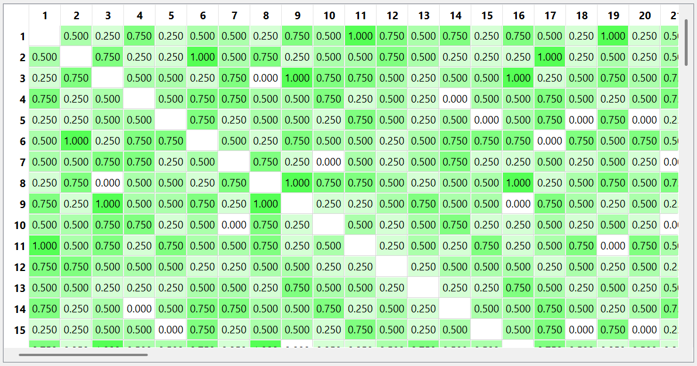

---
jupytext:
  formats: md:myst
  text_representation:
    extension: .md
    format_name: myst
    format_version: 0.13
    jupytext_version: 1.11.5
kernelspec:
  display_name: Python 3
  language: python
  name: python3
---
# Binary
Menghitung jarak data binary beberapa sampel dari data dibawah ini
```{code-cell}
:tags: [hide-input]
import pandas as pd
import numpy as np
df = pd.read_csv("../../data/Churn_Modelling.csv")
df.head(5)
```

Dari data diatas, kita pilih yang merupakan fitur dengan tipe data biner. fitur dengan tipe data biner yaitu `Gender`, `HasCrCard`, `IsActiveMember` dan `Exited`, sehingga jika dihitung akan didapatkan hasil sebagai berikut:

$$
q(1,1) = 2 \\
r(1,0) = 2 \\
s(0,1) = 0 \\ 
t(0,0) = 0 
$$

Karena tipe data ini merupakan biner simetris, maka digunakan rumus sebagai berikut

$$
\begin{aligned}
D &= \frac{r + s}{q + r + s + t}\\[10pt]
D &= \frac{2+0}{2+2+0}\\[10pt]
D &= \frac{2}{4} = 0.5
\end{aligned}
$$

Hasil perhitungan diatas jika diimplementasikan pada Python maka akan didapatkan hasil sebagai berikut
```{code-cell}
:tags: [hide-input]
from scipy.spatial.distance import jaccard
binary_cols = [
    'Gender', 
    'HasCrCard', 
    'IsActiveMember', 
    'Exited'
]
df_binary = df[binary_cols]
p1 = df_binary.iloc[0]
p2 = df_binary.iloc[1]
jaccard_distance = jaccard(p1, p2)
print("Jaccard Distance:", jaccard_distance)
```

Gambar dibawah ini menunjukkan hasil dari implementasi pada Orange Data Mining


```{note}
Pada implementasi diatas, data yang digunakan adalah data pertama dan kedua
```