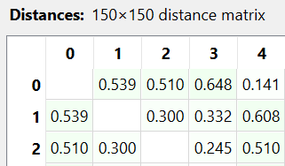
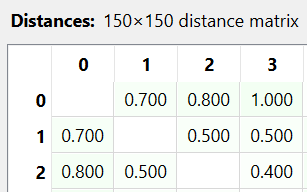

---
jupytext:
  formats: md:myst
  text_representation:
    extension: .md
    format_name: myst
    format_version: 0.13
    jupytext_version: 1.11.5
kernelspec:
  display_name: Python 3
  language: python
  name: python3
---

# Iris

Menghitung jarak data numerik dari salah satu sampel data dibawah ini
```{code-cell}
:tags: [hide-input]
import pandas as pd
import numpy as np
df = pd.read_csv("../../data/IRIS.csv")
df.head(5)
```
## Euclidean
Jarak objek pertama dan objek kedua apabila dihitung menggunakan metode Euclidean maka akan mendapatkan hasil sebagai berikut

```{math}
:class: text-left

\begin{aligned}
d(\mathbf{p}, \mathbf{q}) &= \sqrt{\sum_{i=1}^{n} (p_i - q_i)^2} \\[10pt]
d(\mathbf{1}, \mathbf{2}) &= \sqrt{(5.1-4.9)^2 + (3.5-3)^2 + (1.4-1.4)^2 + (0.2-0.2)^2} \\[10pt]
d(\mathbf{1}, \mathbf{2}) &= \sqrt{0.04 + 0.25 + 0 + 0} \\[10pt]
d(\mathbf{1}, \mathbf{2}) &= \sqrt{0.29} = 0.538516481
\end{aligned}

```
Hasil diatas jika diimplementasikan kedalam Python akan mendapatkan hasil sebagai berikut:

```{code-cell}
:tags: [hide-input]
df_numeric = df.select_dtypes(include=[np.number])
point1 = df_numeric.iloc[0]
point2 = df_numeric.iloc[1]

euclidean_distance = np.sqrt(np.sum((point1 - point2)**2))
print("Jarak Euclidean:", euclidean_distance)
```
Gambar dibawah ini menunjukkan hasil dari implementasi pada Orange Data Mining


## Manhattan
Jarak objek pertama dan objek kedua apabila dihitung menggunakan metode Manhattan maka akan mendapatkan hasil sebagai berikut

```{math}
:class: text-left

\begin{aligned}
d(\mathbf{x}, \mathbf{y}) &= \sum_{i=1}^{n} |x_i - y_i| \\[10pt]
d(\mathbf{1}, \mathbf{2}) &= |5.1 - 4.9| + |3.5 - 3| + |1.4 - 1.4| + |0.2 - 0.2| \\[10pt]
d(\mathbf{1}, \mathbf{2}) &= 0.2 + 0.5 + 0 + 0 \\[10pt]
d(\mathbf{1}, \mathbf{2}) &= 0.7 \\[10pt]
\end{aligned}

```

Hasil diatas jika diimplementasikan kedalam Python akan mendapatkan hasil sebagai berikut:

```{code-cell}
:tags: [hide-input]
manhattan_distance = np.sum(abs(point1 - point2))
print("Jarak Manhattan:", manhattan_distance)
```

Gambar dibawah ini menunjukkan hasil dari implementasi pada Orange Data Mining


