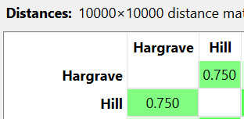

---
jupytext:
  formats: md:myst
  text_representation:
    extension: .md
    format_name: myst
    format_version: 0.13
    jupytext_version: 1.11.5
kernelspec:
  display_name: Python 3
  language: python
  name: python3
---
# Kategorikal
Menghitung jarak data binary beberapa sampel dari data dibawah ini
```{code-cell}
:tags: [hide-input]
import pandas as pd
import numpy as np
df = pd.read_csv("../../data/Churn_Modelling.csv")
df.head(5)
```

Pada data diatas, yang dihitung hanya atribut  dengan tipe data kategorikal selain itu diabaikan

atribut yang dihitung adalah Geography, HasCrCard, IsActiveMember, Exited sehingga didapatkan hasil sebagai berikut
```{code-cell}
:tags: [hide-input]

cols = [
    "Geography","HasCrCard","IsActiveMember","Exited"
]

p1 = df.loc[0, cols].values
p2 = df.loc[1, cols].values

distance = np.mean(p1 != p2)

print(distance)
```

Gambar dibawah ini menunjukkan hasil dari implementasi pada Orange Data Mining


```{note}
Pada implementasi diatas, data yang digunakan adalah data pertama dan kedua
```