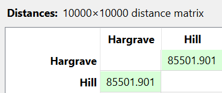
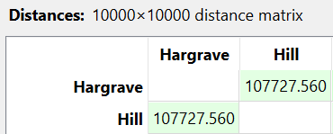

---
jupytext:
  formats: md:myst
  text_representation:
    extension: .md
    format_name: myst
    format_version: 0.13
    jupytext_version: 1.11.5
kernelspec:
  display_name: Python 3
  language: python
  name: python3
---
# Numerik
Menghitung jarak data numerik dari salah satu sampel data dibawah ini
```{code-cell}
:tags: [hide-input]
import pandas as pd
import numpy as np
df = pd.read_csv("../../data/Churn_Modelling.csv")
df.head(5)
```

Data diatas didapatkan dari platform [Kaggle](https://www.kaggle.com/datasets/marslinoedward/bank-customer-churn-prediction)
## Euclidean
Kita ambil sampel data pertama dan kedua untuk menghitung jarak dari kedua data tersebut. implementasi pertama menggunakan Python dengan sintaks `df.select_dtypes(include=[np.number])` dari modul `numpy` untuk memilih fitur numerik yang ada pada dataset tersebut. Fitur dengan tipe data numerik dapat dilihat sebagai berikut
```{code-cell}
df_numeric = df.select_dtypes(include=[np.number])
print(df_numeric.dtypes)
```
Dari fitur diatas, diambil data pertama dan kedua untuk dihitung jaraknya, dan didapatkan hasilnya sebagai berikut 
```{code-cell}
:tags: [hide-input]
df_numeric = df.select_dtypes(include=[np.number])
point1 = df_numeric.iloc[0]
point2 = df_numeric.iloc[1]

euclidean_distance = np.sqrt(np.sum((point1 - point2)**2))
print("Jarak Euclidean:", euclidean_distance)
```

Gambar dibawah ini menunjukkan hasil dari implementasi pada Orange Data Mining


## Manhattan
Perbedaan rumus antara Euclidean dan Manhattan yaitu hasil pengurangan dari setiap fitur tidak dipangkatkan kemudian tidak di akarkan, sehingga jika diimplementasikan pada Python akan mendapatkan hasil sebagai berikut: 

```{code-cell}
:tags: [hide-input]
manhattan_distance = np.sum(abs(point1 - point2))
print("Jarak Manhattan:", manhattan_distance)
```
Gambar dibawah ini menunjukkan hasil dari implementasi pada Orange Data Mining
