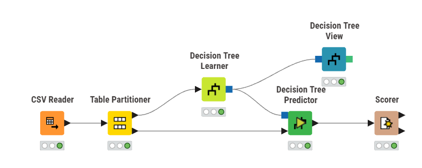
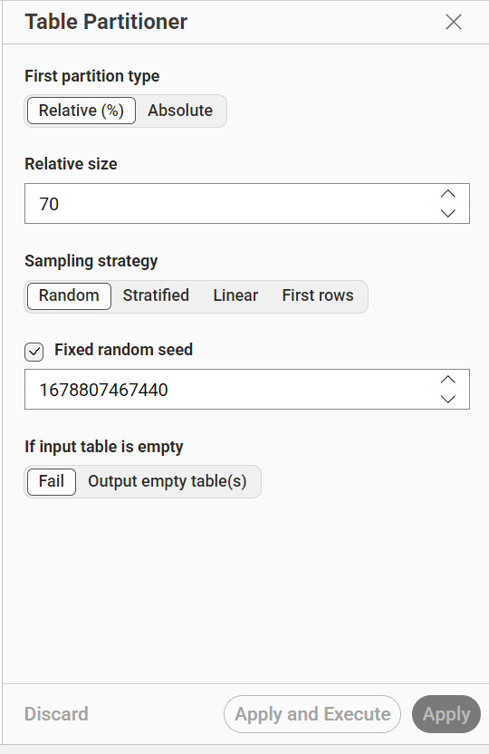
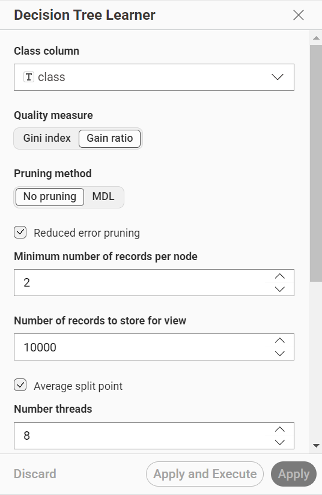
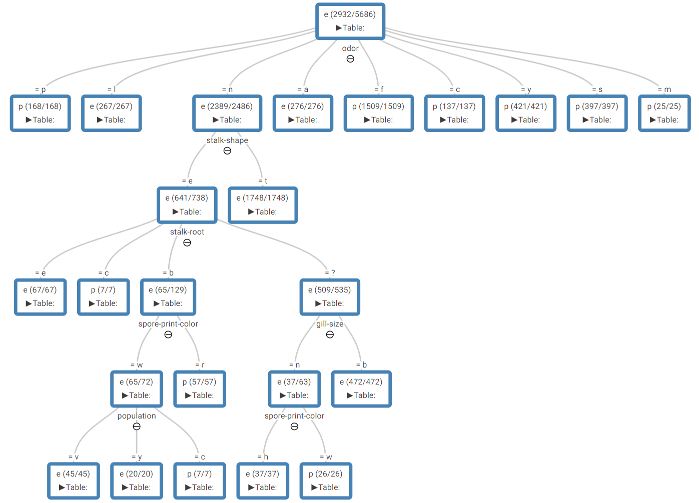
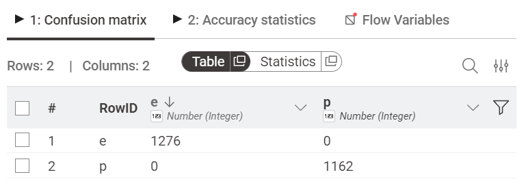
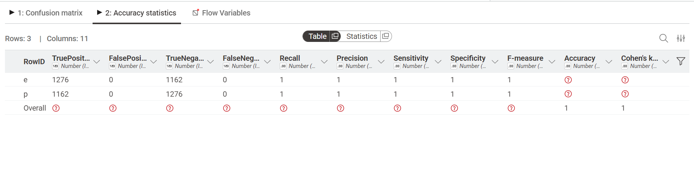

# Decission Tree
## Dataset
Dataset yang digunakan untuk klasifikasi menggunakan metode naive bayes adalah `Mushroom Classification Dataset`. Dataset ini berisi deskripsi sampel hipotetis dari 23 spesies jamur berjenis insang (gilled mushrooms) dari famili Agaricus dan Lepiota. Setiap spesies diidentifikasi sebagai dapat dimakan (edible), beracun (poisonous), atau tidak diketahui edibilitasnya. Kelas terakhir digabung ke kelas poisonous.

Link : [Mushroom Classification Dataset](https://www.kaggle.com/datasets/uciml/mushroom-classification)

Dataset ini miliki 8.124 baris data, 22 fitur yang bertipe kategorikal dan 1 label yang bernama `class` yang memiliki 2 nilai, yaitu `e` atau _Edible_ yang berarti jamur bisa dimakan dan `p` atau _Poisonous_ yang berarti jamur beracun atau tidak bisa dimakan.

Berikut seluruh fitur beserta nilai kategorinya:

|No| Nama Fitur                     | Deskripsi                          | Nilai Kategori                                                                 |
|----|-------------------------------|------------------------------------|--------------------------------------------------------------------------------|
| 1  | cap-shape                    | Bentuk tudung                      | bell, conical, convex, flat, knobbed, sunken                                  |
| 2  | cap-surface                  | Permukaan tudung                   | fibrous, grooves, scaly, smooth                                               |
| 3  | cap-color                    | Warna tudung                       | brown, buff, cinnamon, gray, green, pink, purple, red, white, yellow          |
| 4  | bruises                      | Ada memar?                         | bruises, no                                                                   |
| 5  | odor                         | Bau jamur                          | almond, anise, creosote, fishy, foul, musty, none, pungent, spicy             |
| 6  | gill-attachment              | Cara insang menempel               | attached, descending, free, notched                                           |
| 7  | gill-spacing                 | Jarak antar insang                 | close, crowded, distant                                                       |
| 8  | gill-size                    | Ukuran insang                      | broad, narrow                                                                 |
| 9  | gill-color                   | Warna insang                       | black, brown, buff, chocolate, gray, green, orange, pink, purple, red, white, yellow |
| 10 | stalk-shape                  | Bentuk batang                      | enlarging, tapering                                                           |
| 11 | stalk-root                   | Akar batang                        | bulbous, club, cup, equal, rhizomorphs, rooted, missing(?)                    |
| 12 | stalk-surface-above-ring     | Permukaan batang atas ring         | fibrous, scaly, silky, smooth                                                 |
| 13 | stalk-surface-below-ring     | Permukaan batang bawah ring        | fibrous, scaly, silky, smooth                                                 |
| 14 | stalk-color-above-ring       | Warna batang atas ring             | brown, buff, cinnamon, gray, orange, pink, red, white, yellow                 |
| 15 | stalk-color-below-ring       | Warna batang bawah ring            | brown, buff, cinnamon, gray, orange, pink, red, white, yellow                 |
| 16 | veil-type                    | Tipe selubung                      | partial, universal                                                            |
| 17 | veil-color                   | Warna selubung                     | brown, orange, white, yellow                                                  |
| 18 | ring-number                  | Jumlah cincin                      | none, one, two                                                                |
| 19 | ring-type                    | Tipe cincin                        | cobwebby, evanescent, flaring, large, none, pendant, sheathing, zone          |
| 20 | spore-print-color            | Warna cetak spora                  | black, brown, buff, chocolate, green, orange, purple, white, yellow           |
| 21 | population                   | Pola pertumbuhan                   | abundant, clustered, numerous, scattered, several, solitary                   |
| 22 | habitat                      | Habitat tumbuh                     | grasses, leaves, meadows, paths, urban, waste, woods                          |

## Implementasi Pada KNime
Workflow ini dirancang menggunakan tools KNIME untuk membangun model klasifikasi Decision Tree. Bertujuan untuk menentukan apakah jenis jamur bisa dikonsumsi atau tidak.



### Partisi
Langkah awal setelah membaca dataset adalah melakukan partisi, yaitu untuk membagi data training dan data testing. Dalam kasus ini, saya menggunakan data sebanyak 70% sebagai data training dan 30% sebagai data testing.



### Decission Tree Learner


Dikarenakan saya menggunakan `Gain Ratio` pada _Quality Measure_, maka perlu menghitung `Gain Ratio` tertinggi untuk menentukan _Root_ atau akar dari `Decission Tree` dengan rumus sebagai berikut.

$$
\begin{aligned}
\\[10pt]
GainRATIO_{split} &= \frac{Gain_{split}}{SplitINFO} \\[10pt]
Gain_{split} &= Entropy(p) - (\sum_{i=1}^{k} {\frac{n_{i}}{n}Entropy(i)})  \\[10pt]
Entropy(t) &= - \sum{p(j|t) log(p(j|t))}  \\[10pt]
SplitINFO &= - \sum_{i=1}^k{\frac{n_{i}}{n}Log\frac{n_{i}}{n}}
\end{aligned}
$$

Dimana :
1.  $GainRATIO_{split}$ merupakan nilai rasio gain untuk suatu atribut pemisah (split). Semakin tinggi nilainya, semakin baik atribut tersebut dipilih sebagai node pemisah.
2. $Gain_{split}$ merupakan selisih entropy sebelum dan sesudah pemisahan data berdasarkan atribut tertentu. Mengukur seberapa besar pengurangan ketidakpastian setelah data dipecah.
    - $Entropy(p)$ merupakan Entropy dari dataset induk (parent) sebelum split
    - $k$ merupakan Jumlah cabang/subset hasil pemisahan 
    - $i$ merupakan Indeks cabang ke-i (dari 1 sampai k)
    - $n$ merupakan Jumlah total data di node induk
    - $n_{i}$ merupakan Jumlah data pada cabang/subset ke-i
    - $Entropy(i)$ merupakan Entropy dari subset ke-i setelah split
3. $Entropy(t)$ Mengukur tingkat ketidakmurnian (impurity) atau ketidakpastian pada node $t$
    - $t$ Node yang sedang dihitung
    - $j$ Label kelas ke-j
    - $p(j|t)$ Probabilitas kelas j pada node t
    - $log$ Logaritma basis 2 ($log_{2}$)
```{note}
Entropy = 0 berarti data murni (satu kelas)

Entropy = 1 berarti data paling tidak pasti (seimbang antar kelas)
```

4. $SplitINFO$ Mengukur seberapa luas dan merata suatu atribut membagi data. Digunakan sebagai pembagi (denominator) agar atribut dengan banyak cabang tidak selalu dipilih.
    - $k$ Jumlah cabang hasil split
    - $n_{i} / n$ Proporsi data pada cabang ke-i
    - $Log(n_{i} / n)$ Logaritma basis 2 dari proporsi tersebut

#### Hitung Entropy Root
- Jumlah kelas `e` = 4208
- Jumlah kelas `p` = 3916
- Jumlah Data = 8124

$$
\begin{aligned}
Entropy(s) &= -\frac{4208}{8124} \log_2 \left(\frac{4208}{8124}\right) 
             - \frac{3916}{8124} \log_2 \left(\frac{3916}{8124}\right) \\[1em]
Entropy(s) &= -0.5182 \times (-0.9488) - 0.4818 \times (-1.0536) = 0.9991
\end{aligned}
$$

#### Hitung Gain, Split Info, dan Gain Ratio tiap Atribut
###### Atribut `Odor`
1. Hitung entropy pada tiap nilai

    Dikarenakan atribut `odor` memiliki 9 nilai unik(kategorikal), maka perlu menghitung masing masing entropy pada nilai tersebut dengan rumus:

    $ Entropy(v) = - \frac{e_{v}}{n_{v}} \log_2 (\frac{e_{v}}{n_{v}}) -  \frac{p_{v}}{n_{v}} \log_2 (\frac{p_{v}}{n_{v}})$
    - Odor `a` (almond)
        - $n = 400$
        - $e = 400$
        - $p = 0$

        $$
            \begin{aligned}
            Entropy(a) &= - \frac{400}{400} \log_2 (\frac{400}{400}) -  \frac{0}{400} \log_2 (\frac{0}{400}) \\[10pt]
            Entropy(a) &= - 1 \log_2 (1) -  0 \\[10pt]
            Entropy(a) &= 0
            
            \end{aligned}
        $$
    
    - odor `n` (none) 
        - $n = 3528$
        - $e = 3408$
        - $p = 120$

        $$
            \begin{aligned}
            Entropy(n) &= - \frac{3408}{3528} \log_2 (\frac{3408}{3528}) -  \frac{120}{3528} \log_2 (\frac{120}{3528}) \\[10pt]
            Entropy(n) &= - 0.9660 \times (-0.0499) - 0.0340 \times (-4.8793) \\[10pt]
            Entropy(n) &= 0.0482 + 0.1660 = 0.2141
            
            \end{aligned}
        $$
    - odor `l`, `f`, `c`, `y`, `s`, `p`, `m`. dikarenakan semua bernilai `p` atau _poisonous_ maka nilai $entropy(v) = 0$
2. Hitung Gain Split

    untuk menghitung Gain Split, digunakan rumus sebagai berikut:

    $Gain_{split} = Entropy(p) - (\sum_{i=1}^{k} {\frac{n_{i}}{n}Entropy(i)}) $

    Hitung Weighted Entropy:
    
    $$
    \begin{aligned}
     &= \frac{400}{8124}(0) + \frac{400}{8124}(0) + \frac{3528}{8124}(0.2141) +\frac{2160}{8124}(0) \\[10pt]
     & + \frac{192}{8124}(0) + \frac{576}{8124}(0) + \frac{576}{8124}(0) + \frac{256}{8124}(0) +\frac{36}{8124}(0) \\[10pt]
     &= 0+0+0.4344 \times 0.2141 + 0 + 0 + 0 + 0 + 0 + 0 \\[10pt]
     &= 0.0930
     \end{aligned}
    $$

    Maka :

    $Gain_{split} = 0.9991 - 0.0930 = 0.9061$

3. Hitung Split Info

    untuk menghitung Split Info, digunakan rumus sebagai berikut:
    
    $SplitINFO = - \sum_{i=1}^k{\frac{n_{i}}{n}Log\frac{n_{i}}{n}}$

    maka :

    $$
    \begin{aligned}
        SplitINFO &= - \sum_{i=1}^k{\frac{n_{i}}{n}Log\frac{n_{i}}{n}} \\[10pt]
        SplitINFO(odor) &= - \frac{400}{8124} \log_2 \frac{400}{8124} - \frac{400}{8124} \log_2 \frac{400}{8124}
                            -\frac{3528}{8124} \log_2 \frac{3528}{8124} -\frac{2160}{8124} \log_2 \frac{2160}{8124} \\[10pt]
                            & -\frac{192}{8124} \log_2 \frac{192}{8124} -\frac{576}{8124} \log_2 \frac{576}{8124}
                            -\frac{576}{8124} \log_2 \frac{576}{8124} -\frac{256}{8124} \log_2 \frac{256}{8124} \\[10pt]
                            & -\frac{36}{8124} \log_2 \frac{36}{8124} \\[10pt]
        SplitINFO(odor)     &= 0.2138 + 0.2138 + 0.5223 + 0.5082 + 0.1276 + 0.2707 + 0.2707 + 0.1571 + 0.0347 \\[10pt] 
                            &= 2.3194
    \end{aligned}
    $$

4. Hitung Gain Ratio

    Untuk menghitung Gain Ratio, digunakan rumus sebagai berikut :

    $GainRATIO_{split} = \frac{Gain_{split}}{SplitINFO}$

    Maka :

    $GainRATIO_{odor} = \frac{0.9061}{2.3194} = 0.3906$

```{note}
Hal yang sama dilakukan untuk semua atribut mulai dari entropy pada tiap nilai, Gain Split, Split Info dan Gain Ratio
``` 

Setelah `Gain Ratio` dari semua atribut dihitung, atribut `odor` memiliki Gain Ratio tertinggi sehingga dipilih sebagai `Root Node`. 
Setelah root ditemukan, proses yang sama persis diulang secara rekursif pada setiap cabang yang belum `pure`, menggunakan subset data dan atribut yang tersisa, sampai semua cabang menjadi Leaf Node.

```{note}
Pure artinya semua data dalam satu node hanya terdiri dari satu kelas saja atau tidak ada campuran (entropy = 0).
```

#### Tree
Setelah semua node `pure`, berarti pohon sudah selesai dibangun. Implementasi pada KNime menggunakan node `Desission Tree View` menghasilkan Tree sebagai berikut



### Decission Tree Predictor
Node ini digunakan untuk menguji kemampuan model tersebut. Node ini akan menerapkan aturan logika yang telah dipelajari ke dalam data testing untuk memprediksi apakah hasilnya `p` atau `e`

#### Confusion Matrik


#### Akurasi
