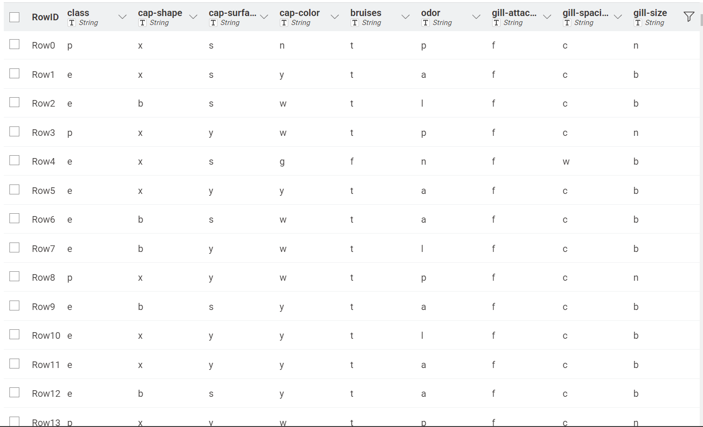
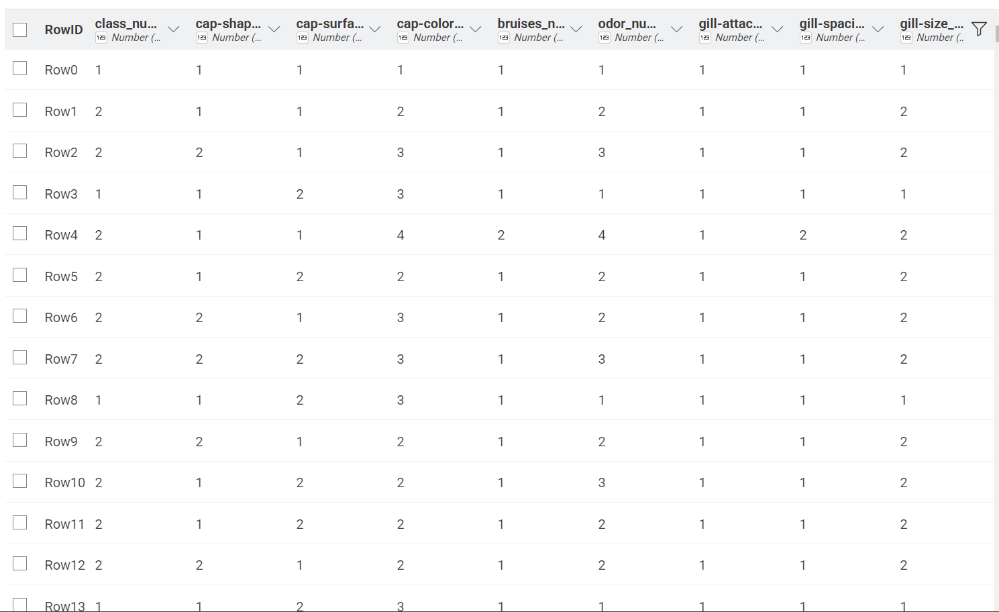
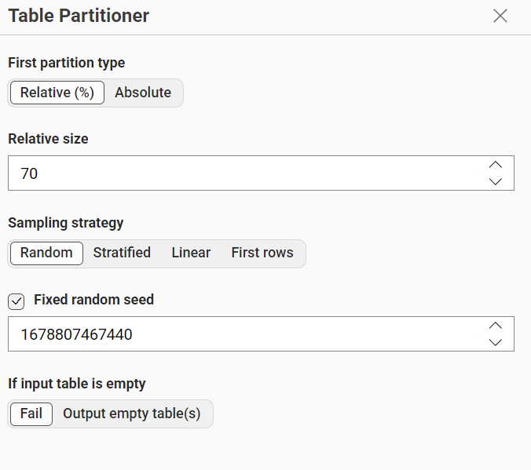
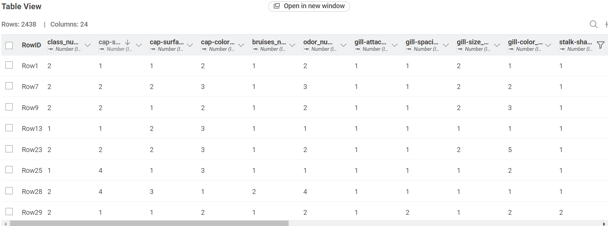
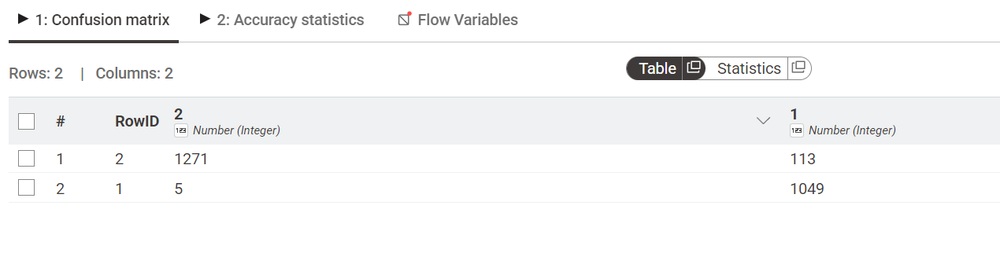
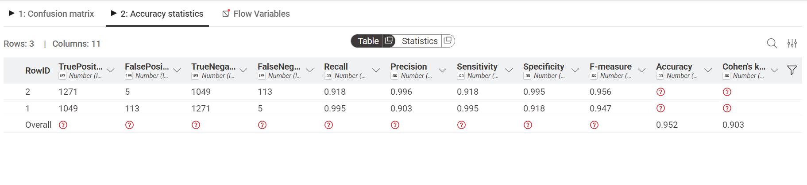
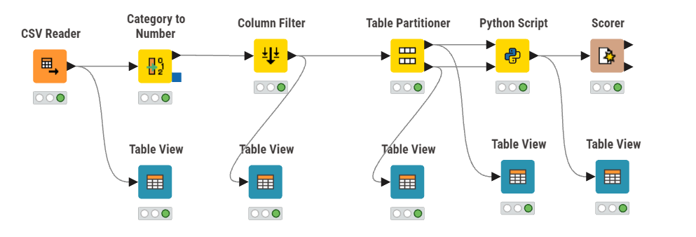

---
jupytext:
  formats: md:myst
  text_representation:
    extension: .md
    format_name: myst
    format_version: 0.13
    jupytext_version: 1.11.5
kernelspec:
  display_name: Python 3
  language: python
  name: python3
---

# Analisis Data Menggunakan Naive Bayes
## Dataset
Dataset yang digunakan untuk klasifikasi menggunakan metode naive bayes adalah `Mushroom Classification Dataset`. Dataset ini berisi deskripsi sampel hipotetis dari 23 spesies jamur berjenis insang (gilled mushrooms) dari famili Agaricus dan Lepiota. Setiap spesies diidentifikasi sebagai dapat dimakan (edible), beracun (poisonous), atau tidak diketahui edibilitasnya. Kelas terakhir digabung ke kelas poisonous.

Link : [Mushroom Classification Dataset](https://www.kaggle.com/datasets/uciml/mushroom-classification)

Dataset ini miliki 8.124 baris data, 22 fitur yang bertipe kategorikal dan 1 label yang bernama `class` yang memiliki 2 nilai, yaitu `e` atau _Edible_ yang berarti jamur bisa dimakan dan `p` atau _Poisonous_ yang berarti jamur beracun atau tidak bisa dimakan.

Berikut seluruh fitur beserta nilai kategorinya:

|No| Nama Fitur                     | Deskripsi                          | Nilai Kategori                                                                 |
|----|-------------------------------|------------------------------------|--------------------------------------------------------------------------------|
| 1  | cap-shape                    | Bentuk tudung                      | bell, conical, convex, flat, knobbed, sunken                                  |
| 2  | cap-surface                  | Permukaan tudung                   | fibrous, grooves, scaly, smooth                                               |
| 3  | cap-color                    | Warna tudung                       | brown, buff, cinnamon, gray, green, pink, purple, red, white, yellow          |
| 4  | bruises                      | Ada memar?                         | bruises, no                                                                   |
| 5  | odor                         | Bau jamur                          | almond, anise, creosote, fishy, foul, musty, none, pungent, spicy             |
| 6  | gill-attachment              | Cara insang menempel               | attached, descending, free, notched                                           |
| 7  | gill-spacing                 | Jarak antar insang                 | close, crowded, distant                                                       |
| 8  | gill-size                    | Ukuran insang                      | broad, narrow                                                                 |
| 9  | gill-color                   | Warna insang                       | black, brown, buff, chocolate, gray, green, orange, pink, purple, red, white, yellow |
| 10 | stalk-shape                  | Bentuk batang                      | enlarging, tapering                                                           |
| 11 | stalk-root                   | Akar batang                        | bulbous, club, cup, equal, rhizomorphs, rooted, missing(?)                    |
| 12 | stalk-surface-above-ring     | Permukaan batang atas ring         | fibrous, scaly, silky, smooth                                                 |
| 13 | stalk-surface-below-ring     | Permukaan batang bawah ring        | fibrous, scaly, silky, smooth                                                 |
| 14 | stalk-color-above-ring       | Warna batang atas ring             | brown, buff, cinnamon, gray, orange, pink, red, white, yellow                 |
| 15 | stalk-color-below-ring       | Warna batang bawah ring            | brown, buff, cinnamon, gray, orange, pink, red, white, yellow                 |
| 16 | veil-type                    | Tipe selubung                      | partial, universal                                                            |
| 17 | veil-color                   | Warna selubung                     | brown, orange, white, yellow                                                  |
| 18 | ring-number                  | Jumlah cincin                      | none, one, two                                                                |
| 19 | ring-type                    | Tipe cincin                        | cobwebby, evanescent, flaring, large, none, pendant, sheathing, zone          |
| 20 | spore-print-color            | Warna cetak spora                  | black, brown, buff, chocolate, green, orange, purple, white, yellow           |
| 21 | population                   | Pola pertumbuhan                   | abundant, clustered, numerous, scattered, several, solitary                   |
| 22 | habitat                      | Habitat tumbuh                     | grasses, leaves, meadows, paths, urban, waste, woods                          |


## Transformasi Data
Karena `Mushroom Classification Dataset` merupakan dataset yang bertipe kategorikal untuk semua kolom, maka pada preprocessing tahap normalisasi yang dilakukan menggunakan encoding. Encoding merupakan proses mengubah data atau informasi dari format aslinya ke dalam format lain yang dapat dipahami oleh mesin atau algoritma, disini kita merubah data dari kategorikal kedalam numerik

Berikut merupakan dataset sebelum dilakukan proses encoding


Dataset setelah dilakukan encoding


## Partisi
Sebelum dilakukan perhitungan naive bayes, diperlukan partisi untuk membagi data training dan data testing. Data training disini saya menggunakan 70% dari dataset dan sisanya sebagai data testing.

## Implementasi Knime Menggunakan library scikit-learn
Implementasi dilakukan menggunakan tools KNIME dengan memanfaatkan library scikit-learn untuk perhitungan metode Naive Bayes. `df_train` merupakan data yang digunakan sebagai data training (80%) yang berada di port bagian atas dan `df_test`merupakan data yang digunakan sebagai data testing(20%) script yang digunakan adalah sebagai berikut

### Script Python
```{code-cell}
:tags: [skip-execution]
import knime.scripting.io as knio
from sklearn.naive_bayes import CategoricalNB

# Data Training
df_train = knio.input_tables[0].to_pandas()

# Data Testing
df_test = knio.input_tables[1].to_pandas()

# Fitur Training
X_train = df_train.iloc[:, 1:].values
# Target Training
y_train = df_train.iloc[:, 0].values

# Fitur Testing
X_test = df_test.iloc[:, 1:].values

# Training Model
model = CategoricalNB()
model.fit(X_train, y_train)

# Prediksi
predictions = model.predict(X_test)

# Tempelkan hasil prediksi ke tabel testing agar bisa dicek Scorer
df_test['Prediction'] = predictions

# Output hasil ujian ke KNIME
knio.output_tables[0] = knio.Table.from_pandas(df_test)
```

### Hasil Prediksi dan Evaluasi Model
Setelah script tersebut dijalankan, maka akan menghasilkan prediction sebagai berikut:


### Confusion Matriks


### Nilai Akurasi


### Implementasi KNime


