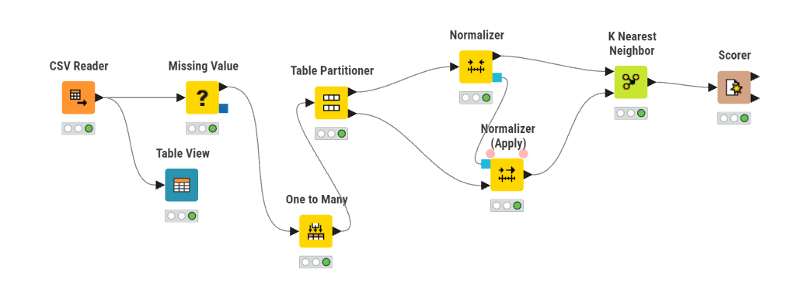
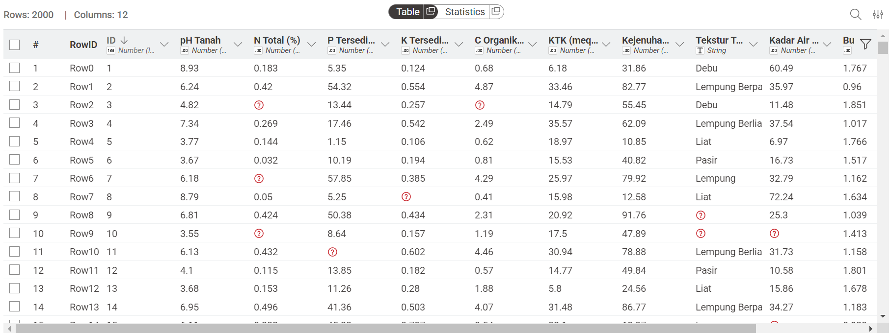
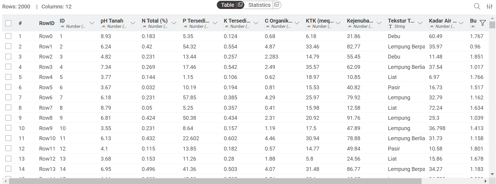
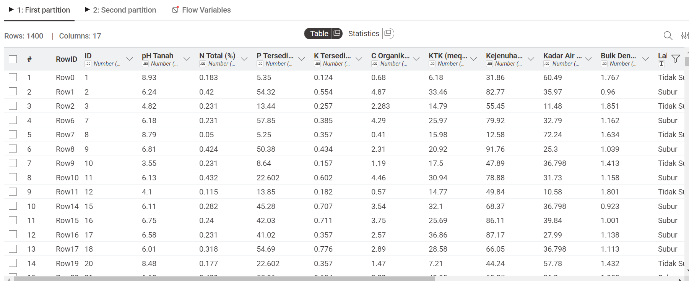
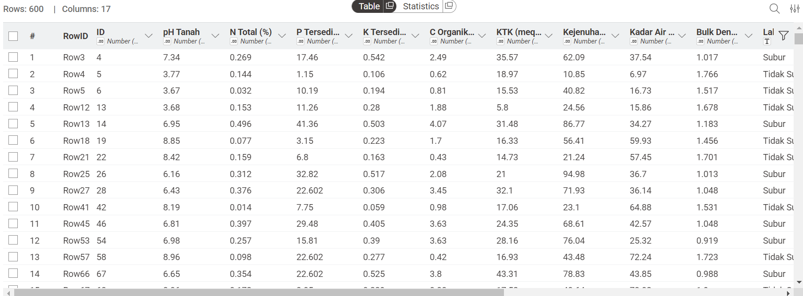
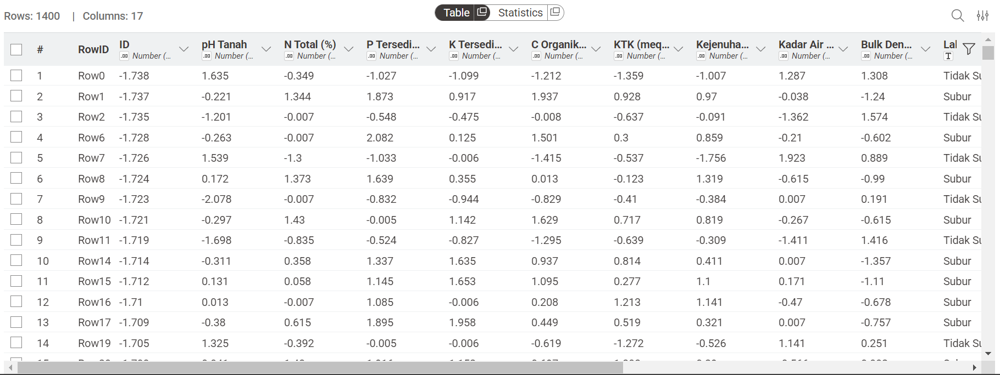
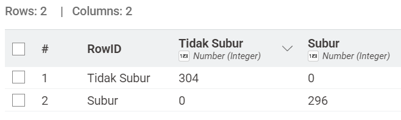
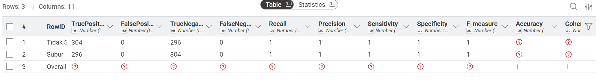

---
jupytext:
  formats: md:myst
  text_representation:
    extension: .md
    format_name: myst
    format_version: 0.13
    jupytext_version: 1.11.5
kernelspec:
  display_name: Python 3
  language: python
  name: python3
---


# Klasifikasi Kesuburan Tanah Menggunakan Model K-Nearest Neighbor
Halaman ini digunakan untuk mengerjakan UTS Penambangan Data Semester Genap 2025/2026

## Dataset
Berikut Merupakan Dataset yang digunakan dalam tugas ini
```{code-cell}
:tags: [hide-input]
import pandas as pd
df = pd.read_csv("../data/dataset_kesuburan_tanah_missing.csv")
df.index = df.index + 1
df.head(2000)
```

Dataset ini berisi 2.000 sampel data tanah yang digunakan untuk mengklasifikasikan apakah kondisi tanah masuk dalam kategori Subur atau Tidak Subur. Pada dataset ini terdapat beberapa missing value yang harus dilakukan imputasi.

Pada Tugas Ini, Saya menganalisis dataset tersebut menggunakan model KNN pada Tools `KNime`

## Penjelasan Implementasi
### Implementasi KNime

### Penjelasan Node
|        Node       |    Penjelasan |
|-------------------|---------------|
| CSV Reader        |  Membaca file CSV yang merupakan Dataset dari sampel data tanah  |
| Missing Value     |  Melakukan Imputasi terhadap missing values  |
| One To Many       | Digunakan untuk mentransformasi nilai dari kolom Tekstur tanah dari kategorikal menjadi numerik |
| Table Partitioner | Melakukan partisi dari dataset menjadi 2, yaitu data training dan data testing |
| Normalizer        | Digunakan untuk melakukan normalisasi terhadap data |
| KNN               | Menghitung jarak Euclidean dan klasifikasi |
| Scorer            | Mengevaluasi hasil prediksi model |

### Missing Values Handling


Tabel diatas menunjukkan bahwa terdapat missing values pada dataset yang digunakan sehingga memerlukan imputasi sebelum dilakukan proses lebih lanjut



Tabel diatas menunjukkan hasil imputasi dari missing values.

### Partisi Data
Setelah dilakukan imputasi terhadap missing values, saya membagi data menjadi 2 yaitu data training sebesar 70% dari data awal dan data testing sebesar 30%. Setelah dibagi, maka jumlah data yang digunakan untuk training yaitu sebanyak 1400 record dan untuk data testing sebanyak 600 record. Implementasi ini menggunakan node `Table Partitioner` pada tools _KNime_ Sehingga didapatkan tabel baru sebagai berikut :






### Normalisasi
Sebelum melakukan penghitungan knn, saya melakukan normalisasi terhadap data training dan data testing untuk agar tidak ada fitur yang terlalu dominan. Pada normalisasi ini, saya menggunakan metode `Z-Score Normalization` sehingga didapatkan hasil seperti berikut.



### Evaluasi
Setelah dilakukan normalisasi, kita uji klasifikasi menggunakan metode KNN dengan nilai $K = 3$ dan target pada kolom Label. Pada Node `K-Nearest Neighbor`, menghasilkan output yaitu confusion matrix dan Accuracy Statistics, sehingga didapatkan hasil sebagai berikut





Berdasarkan tabel diatas mendapatkan hasis akurasi 100% akurat.
